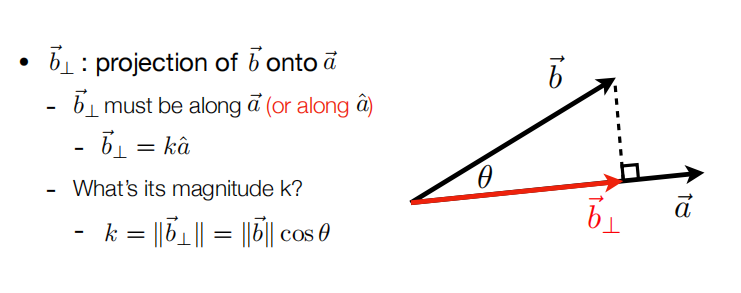
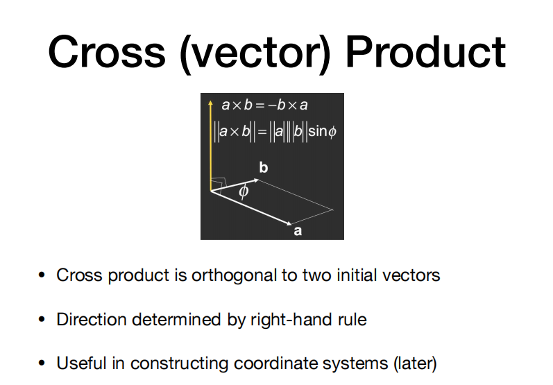
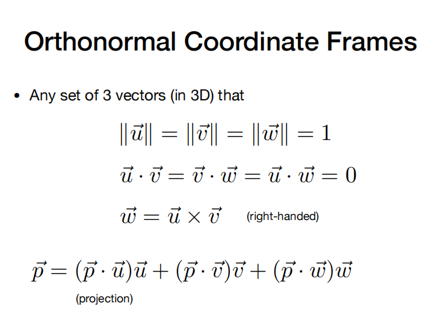
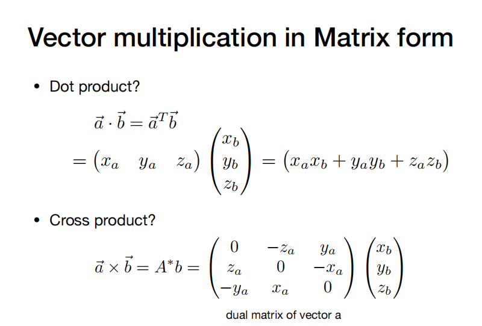

#  Lecture 2: Review of Linear Algebra  
**vector**  
**magniutue**
**unit vertor**  

**dot product** 

**projection**  

**cross product**  

1. Determin left/right
2. determin inside/outside 

**Orthonormal Coordinate Frames**   
 

**matrix**  

