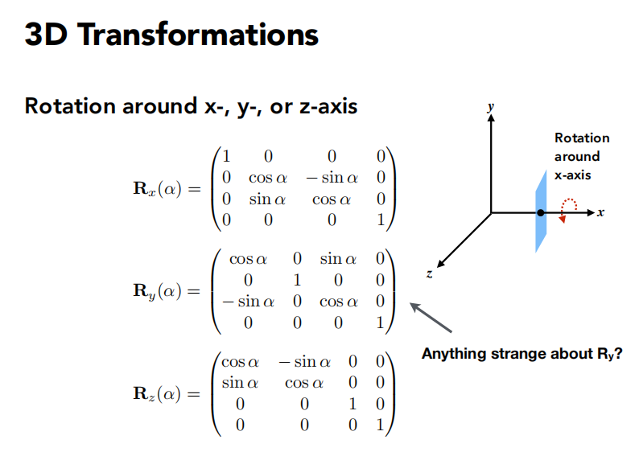
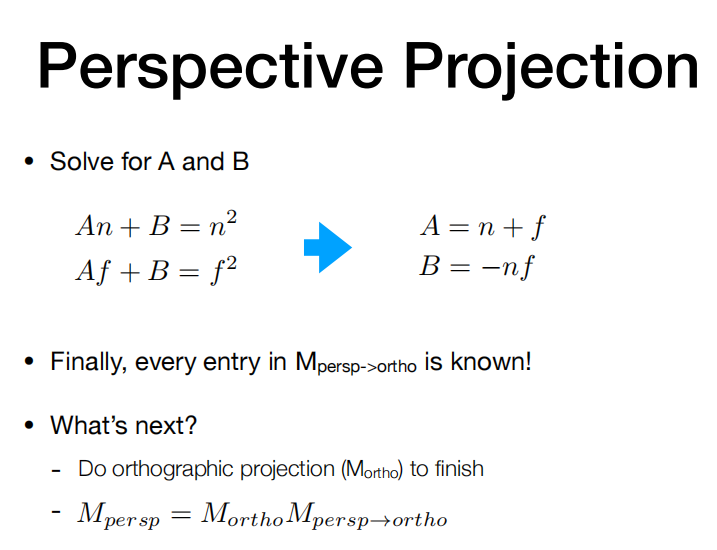

# Lecture 4: Transformation Cont. 
## 3D Transformation
 
 
 

## View/Camera Transformation  

 
  

## Orthorgraphic Projection  
1. translate
2. 
  
  

是否近大远小是两个投影区别。

## Perspective Projection  
 

 
 
 
