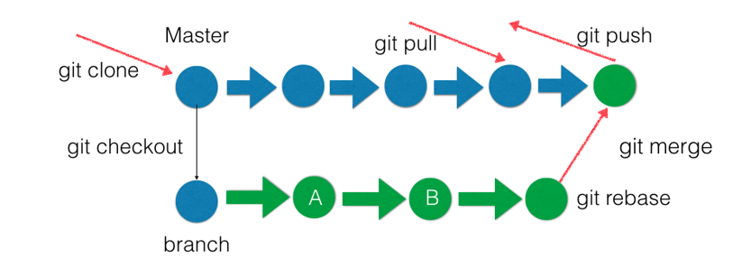
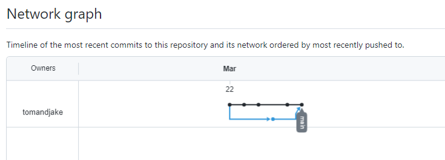

# 高级软件工程实验总结

## 实验一：编辑神器 Visual Studio Code 
本次实验，学会了VS Code的安装配置和使用。体会了其中的一些操作如快捷键的使用，还有挂SSH远程连接的功能等。

## 实验二：五大场景玩转Git 
**实验目标**
 

## 实验三：正则表达式的使用 
本次实验，依次尝试了课件中的关于正则表达式和字符的搜索，替换等。对十分重要的正则表达式首次有了系统的学习。 

## 实验四：
