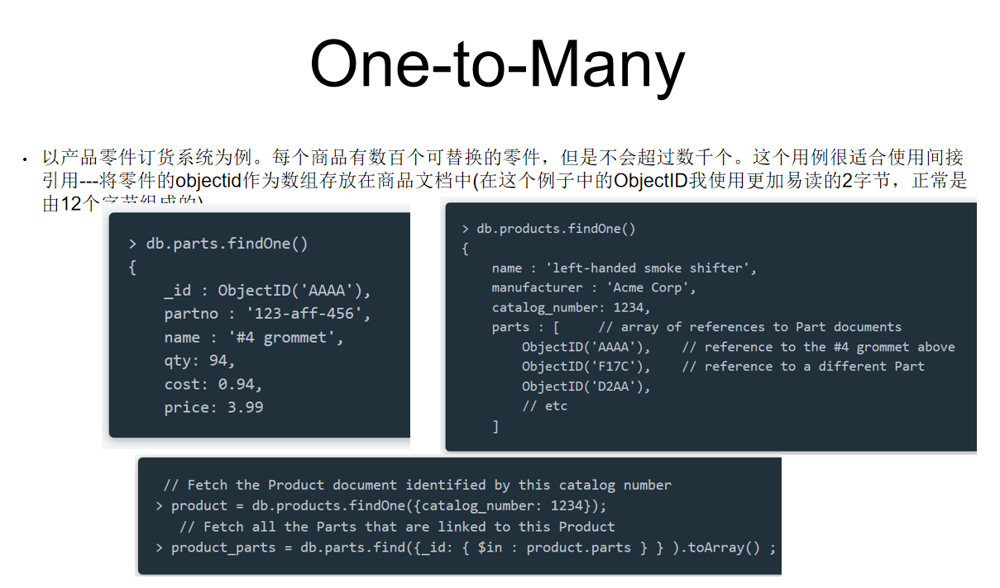
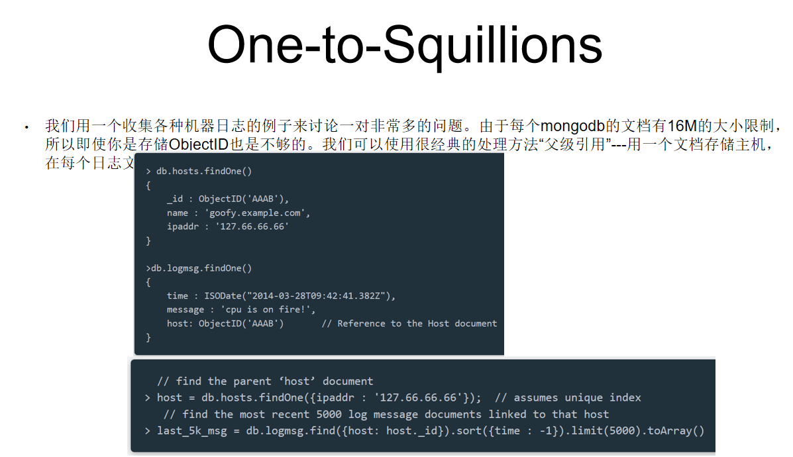
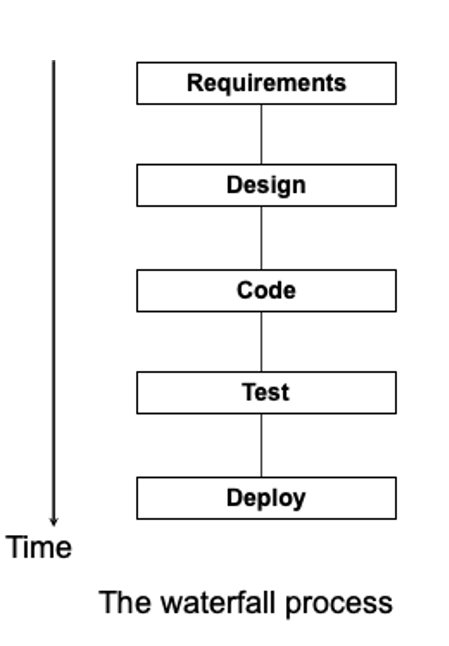

# 从需求分析到软件设计  

## 需求的类型 
1. functional requirement:  required behavior in terms of required activities  
2. nonfunctional requirement: quality characteristic that the software must posses  
3. design constraint: design decision such as platform or interface components  
4. process constraint: restriction on the techniques or resources  

## 和需求相关的人员
client ~ pay for the software to be developed  
customer ~ buy the software  
user: use the system   
domain experts: familiar with the problem that the software must automate  
market researchers: determine future trends and potential customers  
lawyers or auditors: familiar with goverment, legal requirements  
software engineers or other technology experts  

## 获取需求的主要方法  
1. Interviewing stake holders
2. Reviewing available documentations  
3. Observing the current system (if one exists)
4. Apprenticing with users to learn about user's task in more details
5. Interviewing user or stakeholders in groups
6. Using domain specific strategies, such as Joint Application Design
7. Brainstorming with current and potential users

## 高质量的需求  
1. Making Requirements Testable     
2. Resolving Conflicts          
3. Characteristics of Requirements          

## 对需求建模  

## 需求分析的两类方法  
原型化方法 和 建模方法  
原型化 ~  整理用户接口，如界面布局  
建模 ~ 有关事件或活动同步约束问题 在逻辑上形成模型  

## 用例建模  
**用例** 
业务过程  
**用例三个层级** 
1. 抽象用例  干什么 
2. 高层用例  在什么时候开始
3. 扩展用例  将参与者和待开发软件交互过程详细描述出来  
  
 
**准确提取用例的基本方法**
**四个必要条件**  
1. 它是不是业务过程
2. 是不是由某个参与者触发开始
3. 是不是显示的或隐式地终止于某个参与者
4. 是不是为某个参与者完成了有用的业务过程 

**用例图基本画法**   
1. 关联关系 ~ 不强调关联
2. 单向关联 ~ 参与者“知道”用例，用例“不知道”参与者
3. 包含关系  
4. 扩展关系 

 

## 业务领域建模  
开发人员获取业务领域知识的过程。  
**业务领域建模基本步骤**    
1. 收集应用业务领域的信息  
2. 头脑风暴
3. 概念分类  
4. 画出UML类图

**头脑风暴具体**  

**业务领域概念分类方法**   
对象有独立存在，而属性不能独立存在。  

## 业务数据建模  
**关联类及数据模型**  
关联关系时业务数据建模的关键    
  
**关系数据模型的MongoDB设计与实现**  
MongoDB ~ 文档数据库 基于分布式  用类似JSON格式的文档来存储数据  
  
**ACID transaction**   
原子性(Atomicity)  一致性(Consistency)  隔离性(Isolation) 持久性(Durability) 
  
  
  
    

三种设计方案：内嵌，子引用，父引用  
1. 一对很少且不需要单独访问内嵌内容的情况下可以使用内嵌多的一方 
2. 一对很多且很多的一端内容因为各种理由需要单独存在的情况下可以通过数组的方式引用多的一方的。
3. 一对非常多的情况下，请将一的那端引用嵌入进多的一端对象中。  

  

## 业务概念原型
  

## 从需求分析到软件设计  
**瀑布模型**  
  
**统一过程** 
核心要义：用例驱动、以架构为中心、增量且迭代的过程。  
  
**敏捷统一过程的四个关键步骤**  
1. 确定需求  
2. 通过用例的方式满足这些需求 
3. 分配用例到各增量阶段
4. 具体完成各增量阶段所计划的任务
**敏捷统一过程增量阶段**  
1. 用例建模  
2. 业务领域建模 
3. 对象交互建模
4. 形成设计类图 
5. 软件的编码实现和软件应用部署  
**对象交互建模**  
  
**从分析序列图到设计序列图**  

