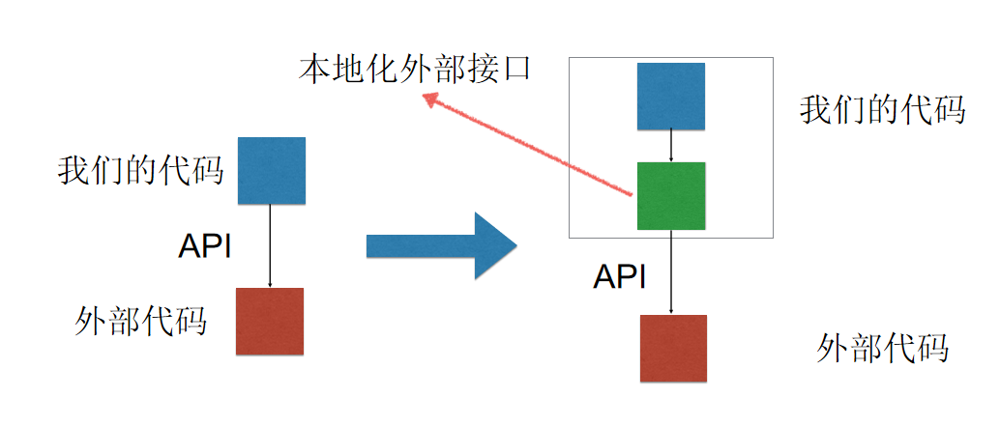
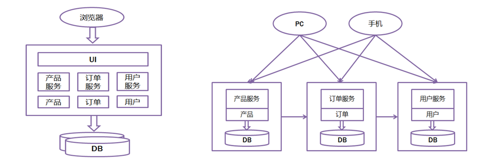

# 代码中的软件工程 

## 编写高质量代码基本方法  
**通过数据结构简化代码**  
**要有错误处理**   
debug版本中所有参数都要验证是否正确；release中从外部传递来的参数要验证正确性。    
肯定如何时用断言；可能发生时用错误处理。  

**性能优先策略背后隐藏的代价**  
1. cost to write the code faster   
2. cost to test the code   
3. cost to understand the code   
4. cost to modify the code   
具体编程时，已经不再需要考虑代码性能问题，将更多精力放在提高工作效率、质量保证等方面。    

**不断重构代码**   
还有极限编程与结对编程  

## 模块化软件设计  
**模块化基本原理**  
关注点的分离。“分而治之”  
使用耦合度和内剧度来衡量模块化的程度。  

无耦合  松散耦合  紧密耦合  

设计合适的接口，以便于模块之间的互相调用。  

KISS原则（Keep it simple & stupid)   
1. 一行代码只做一件事  
2. 一个块代码只做一件事  
3. 一个函数只做一件事  
4. 一个软件模块只做一件事    

**使用本地化外部接口来提高代码适应能力**  
 

## 可重用软件设计  
消费者重用：软件开发者在项目中重用已有的一些软件模块代码  
1. 该软件模块是否能满足所要求的功能。  
2. 采用该软件模块代码是否比从头构建需要更少的工作量  
3. 该软件模块是否有完善的文档说明  
4. 该模块是否有完整的测试和修订记录  
按照上述四个顺序依次评估。  
生产者可重用软件设计  
1. 通用模块
2. 设计通用接口，并且对接口进行完善的定义描述  
3. 记录下发现的缺陷及修订缺陷的情况  
4. 使用清晰一致的命名规则 
5. 对用到的数据结构和算法给出清晰的文档描述  
6. 与外部的参数传递及错误处理部分单独存放易于修改  

## 接口的基本概念 
接口定义了软件模块对系统的其他部分提供了怎样的服务，以及系统的其他部分如何访问所提供的服务。  
面向过程中 ~ 定义了数据结构和操作这些数据结构的函数  
面向对象中 ~ 是对象对外开放的一组属性和方法的集合   
**接口五要素**  
1. 接口目的
2. 接口前置条件
3. 双方遵守的协议规范 
4. 接口使用后的效果
5. 接口隐含的质量属性  

## 微服务的概念  
由一系列微服务共同组成软件系统的一种架构模式。  
微服务见进程隔离，有自己独立的运行环境和软件堆栈。  
每个微服务分解到最小可变产品（MVP）。微服务一般通过RESTful API接口方式进行封装。  
各微服务是分布式管理的，强调隔离性，互相之间无耦合或极其松散的耦合，系统通过前端应用或API网关来聚合各微服务完成整体系统的业务功能。  
**传统单体集中式架构和微服务架构对比**  
   

## RESTful API  
表现层状态转化  
信息实体 ~ URL代表的资源  
状态转化就是对应HTTP协议里的四个动词  
GET ~ 获取资源  
POST ~ 新建/更新资源  
PUT ~ 更新资源  
DELETE ~ 删除资源  

## 通用接口定义的基本方法  
**参数化上下文**  
通过参数传递上下文信息。  
**移除前置条件**  

**简化后置条件**  

## 可重入函数与线程安全  
**线程**  
一个顺序执行的指令流 ~ 线程  
每一个线程都有一个独自拥有的函数调用堆栈空间。    
**可重入函数**  
可重入函数 ~ 可以由多于一个任务并发使用，不必担心数据错误。
可重入函数 要么使用局部变量，要么在使用全局变量时保护自己的数据。  
**可重入函数基本要求**
1. 不为连续的调用持有静态数据  
2. 不返回指向静态数据的指针  
3. 所有数据都由函数的调用者提供  
4. 使用局部变量或者通过全局数据的局部变量拷贝来保护全局数据  
5. 使用静态数据或全局变量时，通过临界区互斥避免临界区冲突
6. 绝不调用任何不可重入函数  
**线程安全**  
代码所在进程由多个线程在同时运行，而这些线程可能会同时运行这段代，每次运行结果和单线程运行结果是一样的，就是线程安全。  
线程安全问题都是由全局变量及静态变量引起的。  

可重入函数不一定是线程安全的。可重入函数在多个线程中并发使用时线程安全，但不同的可重入函数在多个线程中并发使用时会有线程安全问题。  
不可重入函数一定不是线程安全的。  

## 工程化编程实战总结  
看待软件质量的几个不同角度  
软件设计的方法和原则  

