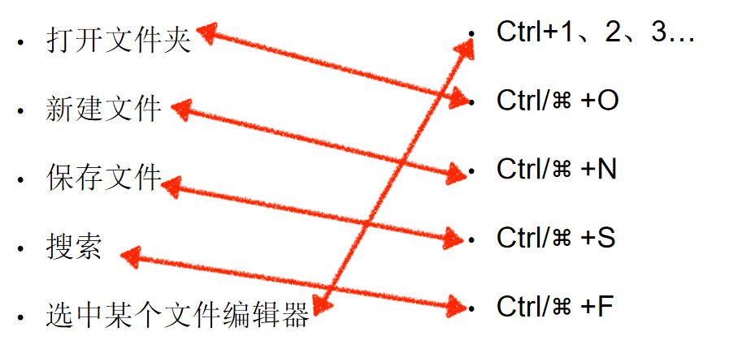

# 工欲善其事必先利其器  

## VScode  
五大主菜单分别是 文件夹，搜索，git, 调试，插件。

文件夹  ctrl+shift+E
搜索  ctrl+shift+F
git  ctrl+shift+G
调试    ctrl+shift+D
插件  ctrl+shift+X 
查看错误和警告 ctrl+shift+M
查找并运行所有命令 ctrl+shift+P 
切换集成终端    ctrl+' 

打开文件夹ctrl+o  
新建文件ctrl+n
关闭文件ctrl+w
ctrl+shift+A代码块注释和取消注释  

编辑器+代码理解+版本控制+远程开发+调试 

**稳定性**
VScode是个Node.js环境，是单线程的，任何代码崩了都是灾难性的后果。  
VScode把插件都放在单独的进程中。  

**一致的用户体验** 
UI界面渲染与业务逻辑隔离。
所有用户的操作被转为各种请求发送给插件进程，插件能做的就是响应这些请求，插件只能专注于业务逻辑处理，不能影响界面元素如何被渲染。

**代码理解与调试**
Language Server Protocal(LSP)  多语言支持的基础 
1.节制的设计  2.合理的抽象  3.周全的细节  
LSP最重要的概念是动作和位置。  抽象成请求和回复

**remote development(VSCRD)** 
可以在远程环境开一个VS Code工作区，然后用本地的VSCode连上去工作。

## 
