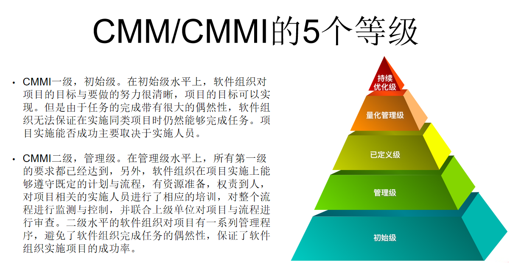
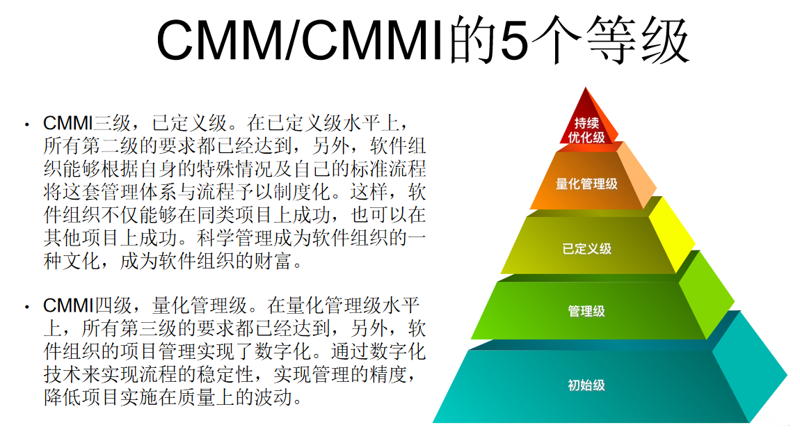
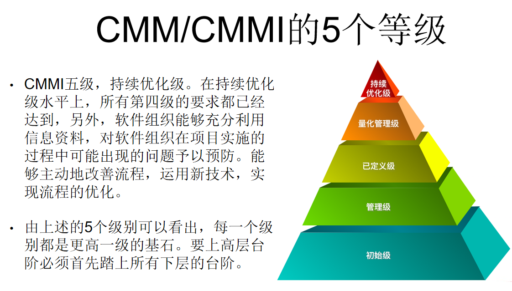
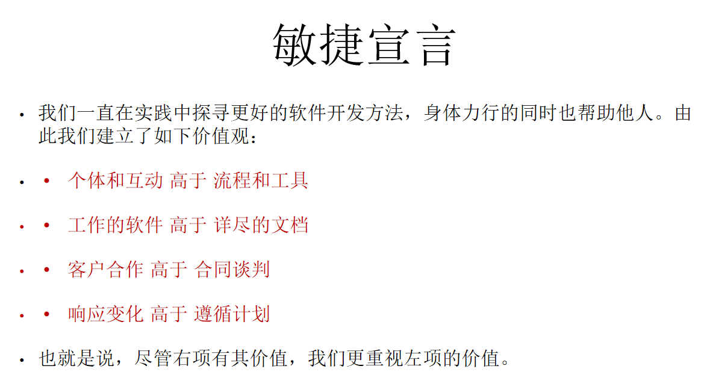
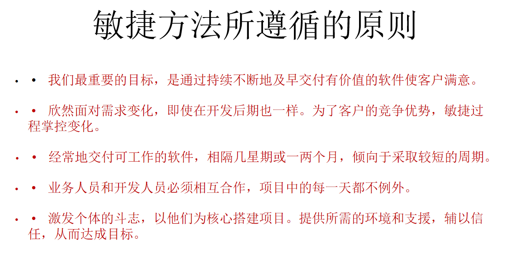
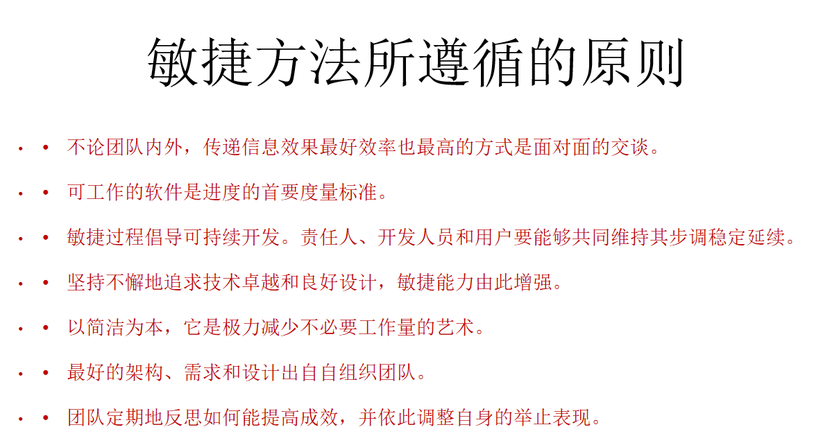
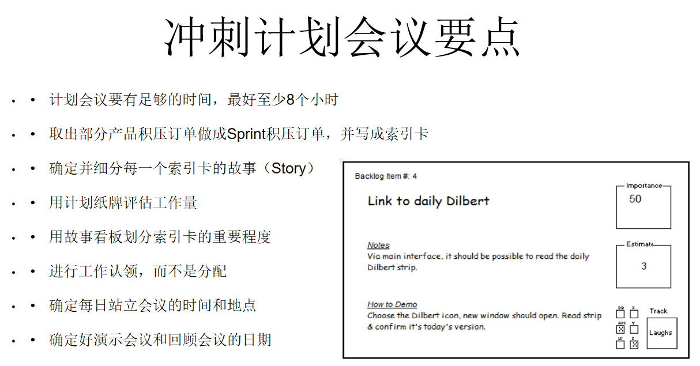
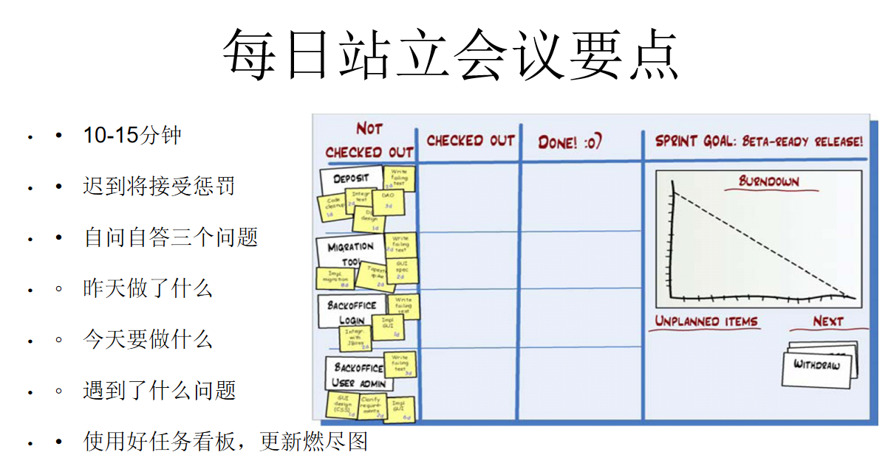
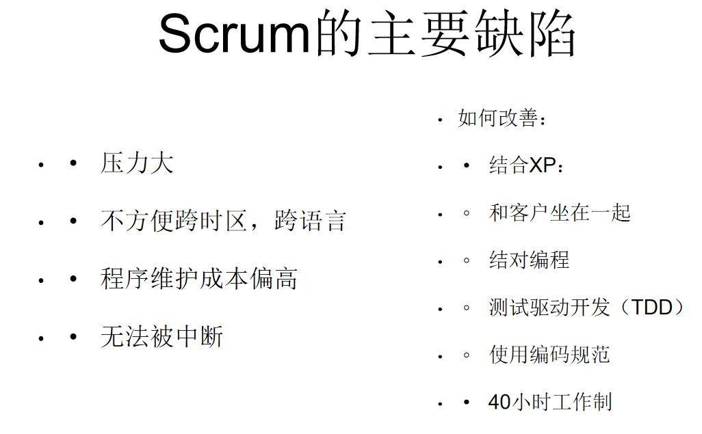

# 软件危机和软件过程  
## 软件危机产生背景  
Brooks的预测是千真万确的，软件危机的困境依然没有从根本上找到解决方法。  
基于规则的编程模型，找不到解决软件危机的杀手锏（银弹）。  
基于联结的编程模型，或许能在软件危机的困境中取得突破。  

## 软件过程模型  
描述性和说明性软件过程  
**瀑布模型**  
原型化瀑布模型 ~ 有利于确认需求是否被准确理解 和 验证技术方案的可行性  
**V模型**  
将瀑布模型前后两端的过程活动结合起来，可以提高过程活动的内聚度。  
生死相依原则  
开始一项工作前，先思考验证该工作的方法。  

**分阶段开发**  
增量开发 ~ 从一个功能子系统开始，每次增加功能。  
迭代开发 ~ 完成一个完整的系统，每次交付会升级其中的某个子系统  

**螺旋模型**  
引入了风险管理。在每个阶段构建原型是螺旋模型减小风险的基本策略。  
每次迭代四个主要阶段  
1. plan
2. determine goals, alternatives and constraints  
3. evaluate alternatives and risks 
4. develop and test  

**个人软件过程PSP**  
  
  
  
  
  

**团队软件过程TSP**  

**项目失败最根本的原因是团队问题**  
  
  
  

## CMM/CMMI  
  
  
  
主要用在两方面：能力评估和过程改进  
**CMMI过程域** 

  

## 敏捷方法  
  
  
 
## Scrum敏捷开发方法 
1. 项目经理 
2. 产品经理  
3. 团队 

每一轮迭代是一个冲刺，包含有  
1. 冲刺规划会议
2. 每日站立会议
3. 冲刺评审会议
4. 冲刺回顾会议  
  

工作和跟踪进展  
1. 产品积压订单
2. 冲刺积压订单 
3. 燃尽图
4. 障碍积压订单 
  
  

**冲刺评审会议要点**  
让老板和客户看到演示效果  
不要关注太多细节，以主要的功能为主   

**冲刺回顾会议讨论的问题举例**  
1. 应该花更多的事件，把故事拆分成更小的条目和任务  
2. 办公室环境太吵了
3. 做出过了过度的承诺，最后只完成了一半工作  

**Scrum基本流程**  
step1: 找出完成产品需要做的事情。 每一项时间估计单位为“天”
step2：决定当前的冲刺。  每一项单位为“小时”
step3: 冲刺。
step4: 得到一个软件的增量版本，冲刺评审会议，发布给用户。  
  

## DevOps  
DevOps是一组过程、方法与系统的统称。 
可以看作开发、技术运营和zhi'liang保障三者的交集。  
“一套旨在缩短从提交变更 到 变更后的系统投入正常生产之间时间，同时确保产品高质量的实践方法”  
可以看作是敏捷方法从技术开发领域扩展到业务运维领域。  
**精益生产**  
**精益创业**  
**最小可行产品MVP**  
