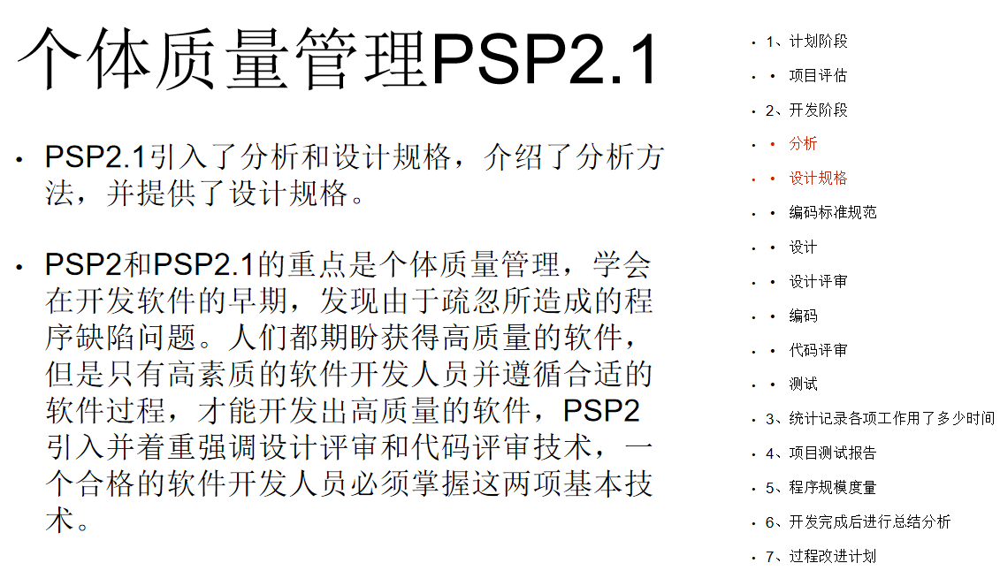

# 软件危机和软件过程  
## 软件危机产生背景  
Brooks的预测是千真万确的，软件危机的困境依然没有从根本上找到解决方法。  
基于规则的编程模型，找不到解决软件危机的杀手锏（银弹）。  
基于联结的编程模型，或许能在软件危机的困境中取得突破。  

## 软件过程模型  
描述性和说明性软件过程  
**瀑布模型**  
原型化瀑布模型 ~ 有利于确认需求是否被准确理解 和 验证技术方案的可行性  
**V模型**  
将瀑布模型前后两端的过程活动结合起来，可以提高过程活动的内聚度。  
生死相依原则  
开始一项工作前，先思考验证该工作的方法。  

**分阶段开发**  
增量开发 ~ 从一个功能子系统开始，每次增加功能。  
迭代开发 ~ 完成一个完整的系统，每次交付会升级其中的某个子系统  

**螺旋模型**  
引入了风险管理。在每个阶段构建原型是螺旋模型减小风险的基本策略。  
每次迭代四个主要阶段  
1. plan
2. determine goals, alternatives and constraints  
3. evaluate alternatives and risks 
4. develop and test  

**个人软件过程PSP**  
  
  
  
  
  

**团队软件过程TSP**  

**项目失败最根本的原因是团队问题**  
  
  
  

**CMMI过程域** 

  

## 敏捷方法  
个体和互动 高于 流程和工具    
工作的软件 高于 详尽的文档  
客户合作 高于 合同谈判  
响应变化 高于 遵循计划  

我们最重要的目标，是通过持续不断地及早交付有价值的软件使客户满意。  
欣然面对需求变化，即使在开发后期也一样。为了客户的竞争优势，敏捷过程掌控变化。  
经常地交付可工作的软件，相隔几星期或一两个月，倾向于采取较短的周期  
业务人员和开发人员必须相互合作，项目中的每一天都不例外  
激发个体的斗志，以他们为核心搭建项目。提供所需的环境和支援，辅以信任，从而达成目标。  
不论团队内外，传递信息效果最好效率也最高的方式是面对面的交谈。  
可工作的软件是进度的首要度量标准。  
敏捷过程倡导可持续开发。责任人、开发人员和用户要能够共同维持其步调稳定延续  
坚持不懈地追求技术卓越和良好设计，敏捷能力由此增强  
以简洁为本，它是极力减少不必要工作量的艺术  
最好的架构、需求和设计出自自组织团队  
团队定期地反思如何能提高成效，并依此调整自身的举止表现  
## Scrum敏捷开发方法 
1. 项目经理 
2. 产品经理  
3. 团队 

每一轮迭代是一个冲刺，包含有  
1. 冲刺规划会议
2. 每日站立会议
3. 冲刺评审会议
4. 冲刺回顾会议  
  

工作和跟踪进展  
1. 产品积压订单
2. 冲刺积压订单 
3. 燃尽图
4. 障碍积压订单 

**冲刺计划会议要点**  
会议要有足够时间，最好至少8小时。  
取出部分产品积压订单做成Sprint积压订单，写成索引卡。  
确定并细分每一个索引卡的故事。  
确定每日站会的时间和地点。  
确定好演示会议和回顾会议的日期。  

**每日站立会议要点**  
10-15min  
昨天做了什么 今天要做什么 遇到了什么问题  
使用好任务看板 更新燃尽图  

**冲刺评审会议要点**  
让老板和客户看到演示效果  
不要关注太多细节，以主要的功能为主   

**冲刺回顾会议讨论的问题举例**  
1. 应该花更多的事件，把故事拆分成更小的条目和任务  
2. 办公室环境太吵了
3. 做出过了过度的承诺，最后只完成了一半工作  

**Scrum基本流程**  
step1: 找出完成产品需要做的事情。 每一项时间估计单位为“天”  
step2：决定当前的冲刺。  每一项单位为“小时”    
step3: 冲刺。  
step4: 得到一个软件的增量版本，冲刺评审会议，发布给用户。    

**Scrum主要缺陷**  
1. 压力大  
2. 程序维护成本高  
3. 无法被中断  
改善：  
结合XP  
测试驱动开发TDD  
40小时工作制  
使用编码规范  

## DevOps  
DevOps是一组过程、方法与系统的统称。 
可以看作开发、技术运营和质量保障三者的交集。  
“一套旨在缩短从提交变更 到 变更后的系统投入正常生产之间时间，同时确保产品高质量的实践方法”  
可以看作是敏捷方法从技术开发领域扩展到业务运维领域。  
**精益生产**  
**精益创业**  
**最小可行产品MVP**  

