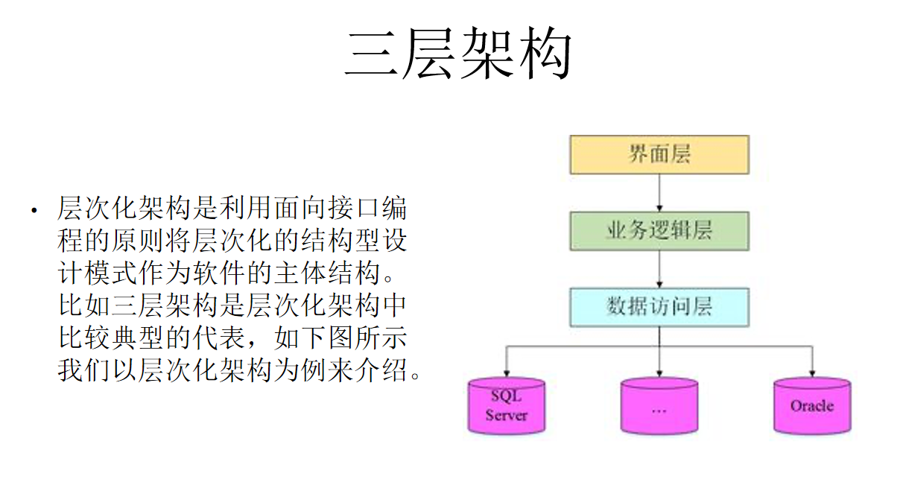

# 软件科学基础概论  
## 软件的基本结构  
1. 顺序结构
2. 分支结构
3. 循环结构
4. 函数调用框架
5. 继承和对象组合  

面向对象的真正威力是封装。在大多数情况下，应该用对象组合替代继承来实现相同的目标。  

## 软件中的一些特殊机制  
1. 回调函数 
2. 多态 
3. 闭包 
4. 异步调用 
5. 匿名函数  

## 软件的复杂性和易变性
**三类系统**
  
  

## 设计模式  
  

设计模式是在某一情境下的问题解决方案  

**设计模式四个部分**  
1. 名称
2. 目的
3. 解决方案
4. 解决方案的约束和限制条件  

**设计模式分类**  
类模式：用于处理类和子类之间的关系，是静态的，在编译时刻就确定下来了。如模板方法。  
对象模式：处理对象之间的关系，可以通过组合或聚合来实现，运行时刻可以变化。组合或聚合关系比继承关系耦合度低，多数设计模式是对象模式。  

创建型模式：描述“怎样创建对象”，特点是“将对象的创建与使用分离”    
结构型模式：将类或对象布局组成更大的结构。分为类结构型模式和对象结构型模式。  
行为型模式：描述程序在运行时复杂的流程控制，多个类或对象之间怎样相互协作共同完成单个对象都无法完成的任务。 

**常用设计模式**  
单例：  
原型：将一个对象为原型，对其复制克隆多个和其类似的新实例。  
建造者：将一个复杂对象分解成多个相对简单的部分，然后根据不同需要分别创建它们，最后构建成该复杂对象。主要应用于复杂对象中的各部分的建造顺序相对固定或者创建复杂对象的算法独立于各组成部分。  
代理：不要和陌生人说话原则。  
适配器：将一个类的接口转换成客户希望的另外一个接口。  
装饰：不改变现有对象结构的情况下，动态地给对象增加一些职责。用对象组合地方式扩展功能。
外观：为复杂的子系统提供一致的接口。  
享元：用共享技术有效支持大量细粒度对象的复用。  
策略：封装一系列算法，算法的改变不影响使用算法的用户。是多态和对象组合的综合应用。  
命令：将请求封装为一个对象，使发出请求的责任和执行请求的责任分割开。这样两者之间通过命令对象进行沟通，这样方便将命令对象进行储存、传递、调用、增加与管理。  
  
职责链：避免请求者与多个请求处理者耦合在一起，所有处理者通过前一对象记住其下一个对象引用而形成一条链。  
中介者：定义一个中介对象简化原有对象之间的交互关系，降低系统中对象之间的耦合度。  在MVC框架中，控制器（C）就是模型（M）和视图（V）的中介者。   

**设计模式背后的原则**   
**开闭原则**  
软件应当对扩展开放，对修改关闭。  
**Liskov替换原则**  
子类可以扩展父类的功能，但是不能修改父类的功能。 
**依赖倒置原则**  
高层模块不应该依赖低层模块，两者都应该依赖其抽象。抽象不应该依赖细节，细节应该依赖抽象。要面向接口编程，不要面向实现编程。   
**单一职责原则**   
单一职责原则规定一个类应该有且仅有一个引起它变化的原因，否则类应该被拆分（There should never be more than one reason for a class to change）。  
**迪米特法则**  
只与你的直接朋友交谈，不跟“陌生人”说话（Talk only to your immediate friends and not to strangers）。  
其含义是：如果两个软件实体无须直接通信，那么就不应当发生直接的相互调用，可以通过第三方转发该调用。其目的是降低类之间的耦合度，提高模块的相对独立性。  
**合成复用原则**  
它要求在软件复用时，要尽量先使用组合或者聚合关系来实现，其次才考虑使用继承关系来实现。 

观察者：  
    
  
  
  
  

## 常见的软件架构举例  

  
**MVC**
  
  

**MVVM**   
  
  

**Vue.js**  
Vue.js是一个前端构建数据驱动的Web界面的库，主要特色是响应式的数据绑定。  
**Vue.js机制**  
  
  
  
  
  

## 软件架构风格与描述方法   
**两种不同层级软件架构复用方法**  
克隆  
重构  
**Popular Design Methods**  
1. functional decomposition  
2. feature-oriented decomposition  
3. data-oriented decomposition  
4. process-oriented decomposition  
5. event-oriented decomposition  
6. object-oriented decomposition  

**软件架构风格与策略**  
1. 管道-过滤器  
2. C/S  
3. P2P
4. 发布-订阅  
5. CRUD  
6. 层次化  

**软件架构的描述方法**  
**分解视图**  
呈现较为明晰的分解结构。  
**依赖视图**  
展现软件模块之间的依赖关系  
**泛化视图**  
展现模块间一般化和具体化的关系。如继承关系。  
**执行视图**  
系统运行时时许结构特点。流程图、时序图等。  
一般将执行视图转换为伪代码之后，再进一步转换为实现代码。
**实现视图**  
软件架构与源文件之间的关系。  ~ 源文件目录树  
有助于在源代码文件中找到具体软件单元的是实现。  
**部署视图**  
执行实体和计算机资源建立映射关系。  
有助于设计人员分析一个设计的质量属性。  
**工作分配图**  
分解成可独立完成的任务，分配给各项目团队和成员。  

## 高质量软件  
**用户角度**
**产品角度**   
McCall软件质量模型  
**三个角度**
1. Product revision (ability to change)
2. Product transition (adaptability to new environments)  
3. Product operations (basic operational characteristics)   
三个角度11个质量要素。  

**过程角度** 
**CMM/CMMI 能力成熟度5个等级**  
  
**价值角度**  
